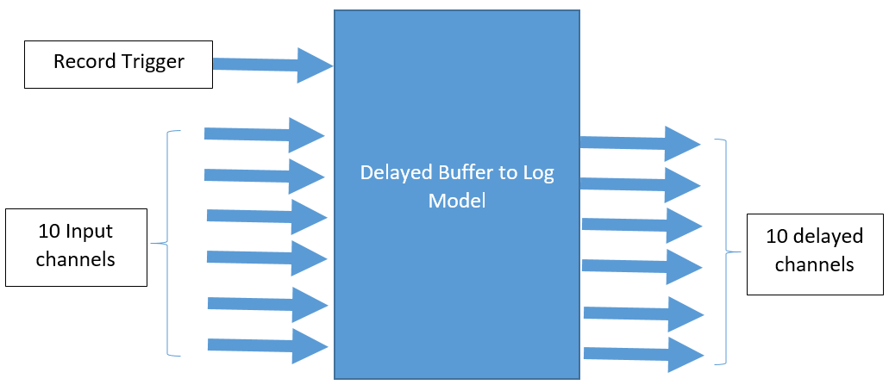
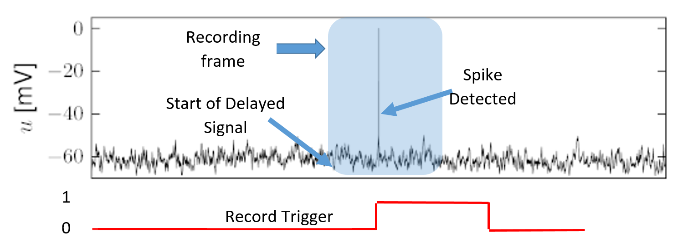

# Delayed Buffer To Log by trigger

This is RTXI model plugin.
The purpose of this model is to have the ability to log history data from channel by trigger.
For example: we want to record 1 millisecond of Volt activity before spike and 2 milliseconds after, when we identify the spike we trigger the model to start record the activity. The recordered data is the delayed buffer, therefor the trigger need to continue 1 milisecond after the 2 millisecond that we wanted to record.

